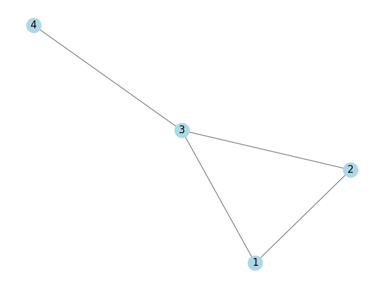

# Graph- Definition and Terminologies

## Lesson Objective
Upon successful completion of the session, the student will be able to:
- Understand the fundamental definitions and terminologies in graph theory.
- Differentiate between simple graphs, finite and infinite graphs, and null graphs.
- Represent and visualize these graphs using Python.

## Introduction
Graph theory is a branch of mathematics that studies the relationships between objects. A graph is a collection of points, called vertices, connected by lines called edges. Graphs are used to model pairwise relations between objects, making them a powerful tool for solving problems in computer science, such as network analysis, scheduling, and optimization.

## Presentation of the Idea and Concept

The elementory concept of the Graph theory shall be explained with the help of a graph drawn in the blackboard.

### Formal Definitions

1. **Vertex (Node)**: A vertex is a fundamental unit of a graph, representing an object. Formally, a vertex is an element of the set $\mathbf{V}$ of vertices.
2. **Edge (Link)**: An edge is a connection between two vertices in a graph. Formally, an edge is an element of the set $\mathbf{E}$ of edges, where each edge $e \in \mathbf{E}$ is an unordered pair of vertices $(u, v)$ for an undirected graph, or an ordered pair $(u, v)$ for a directed graph.
3. **Graph**:  A graph $\mathbf{G}$ is defined as an ordered pair $\mathbf{G} = (\mathbf{V}, \mathbf{E})$, where $\mathbf{V}$ is a set of vertices and $\mathbf{E}$ is a set of edges connecting pairs of vertices.
4. **Incidence**: An edge $e$ is said to be incident to a vertex $v$ if $v$ is one of the endpoints of $e$.
5. **Degree**: The degree of a vertex $v$ in a graph is the number of edges incident to $v$. For a directed graph, we have in-degree and out-degree, which count the incoming and outgoing edges, respectively.
6. **Isolated Vertex**: A vertex with degree zero; it has no edges connected to it.
7. **Pendant Vertex**: A vertex with degree one; it is connected to exactly one other vertex.

### Simple Graph
A simple graph is an unweighted, undirected graph containing no loops (edges connected at both ends to the same vertex) or multiple edges (more than one edge between any two vertices). Each edge connects two different vertices.

**Example:**
Consider a social network where people are vertices, and friendships are edges. A simple graph can represent this network, where each person is connected to their friends by edges.



```python
import networkx as nx
import matplotlib.pyplot as plt

# Create a simple graph
G = nx.Graph()
G.add_edges_from([(1, 2), (1, 3), (2, 3), (3, 4)])

# Draw the graph
nx.draw(G, with_labels=True, node_color='lightblue', edge_color='gray')
plt.title("Simple Graph")
plt.savefig("simple_graph.png")
plt.show()
```
### Finite and Infinite Graphs
>A finite graph has a finite number of vertices and edges, while an infinite graph has an infinite number of vertices or edges.

**Example:**

A finite graph could represent a computer network with a limited number of computers and connections. An infinite graph might model theoretical constructs, like the set of all integers with edges connecting consecutive numbers.
```python
# Create a finite graph
G = nx.Graph()
G.add_edges_from([(1, 2), (2, 3), (3, 4), (4, 5)])

# Draw the graph
nx.draw(G, with_labels=True, node_color='lightgreen', edge_color='black')
plt.title("Finite Graph")
plt.savefig("finite_graph.png")
plt.show()
```

### Null Graph

>A null graph is a graph with no edges. It can have one or more vertices but no connections between them.

**Example:**
A null graph could represent a set of isolated computers in a network with no connections between them.

```python
# Create a null graph
G = nx.Graph()
G.add_nodes_from([1, 2, 3, 4, 5])

# Draw the graph
nx.draw(G, with_labels=True, node_color='lightcoral', edge_color='black')
plt.title("Null Graph")
plt.savefig("null_graph.png")
plt.show()
```

### Incidence and Degree
>The incidence of a vertex in a graph is the set of edges connected to it. The degree of a vertex is the number of edges incident to it.

**Example:**
In the graph below, vertex 1 has a degree of 2 (connected to vertices 2 and 3).

```python
# Create a graph
G = nx.Graph()
G.add_edges_from([(1, 2), (1, 3), (2, 3)])

# Draw the graph
nx.draw(G, with_labels=True, node_color='lightblue', edge_color='gray')
plt.title("Incidence and Degree")
plt.savefig("incidence_degree.png")
plt.show()

# Print degrees
print("Degrees:", dict(G.degree()))
```
### Isolated Vertex
>An isolated vertex has no edges connected to it, meaning its degree is zero.

**Example:**
In the graph below, vertex 4 is isolated.

```python
# Create a graph with an isolated vertex (here vertex 4)
G = nx.Graph()
G.add_edges_from([(1, 2), (1, 3)])
G.add_node(4)  # Isolated vertex

# Draw the graph
nx.draw(G, with_labels=True, node_color='lightblue', edge_color='gray')
plt.title("Isolated Vertex")
plt.savefig("isolated_vertex.png")
plt.show()
```

### Pendant Vertex
>A pendant vertex has exactly one edge connected to it, meaning its degree is one.

**Example:**
In the graph below, vertex 4 is a pendant vertex.

```python
# Create a graph with a pendant vertex
G = nx.Graph()
G.add_edges_from([(1, 2), (1, 3), (3, 4)])

# Draw the graph
nx.draw(G, with_labels=True, node_color='lightblue', edge_color='gray')
plt.title("Pendant Vertex")
plt.savefig("pendant_vertex.png")
plt.show()
```
----

### Practice Problems and Sample Tasks

The students are adviced to work out these problems in the notebook and encourage them to come up with `Pythonic` solutions too.

>**Practice Problem 1:**
Create a simple graph with 6 vertices and 8 edges. Visualize the graph using Python.

>**Practice Problem 2:**
Write a Python function to determine if a given graph is a null graph.

>**Practice Problem 3:**
Draw a graph with the following properties and identify its type:

-  5 vertices
-  Each vertex connected to every other vertex
>**Practice Problem 4:**
Draw a graph with the following properties and identify its type:

- 4 vertices
- 2 edges
- No vertex is connected to itself
>**Practice Problem 5:**
Write a Python function to determine if a given graph is finite or infinite.

>**Practice Problem 6:**
Write a Python function to find the degree of each vertex in a given graph.

>**Practice Problem 5:**
Create a graph with 7 vertices, 5 edges, one isolated vertex, and one pendant vertex. Visualize the graph using Python.

#### Sample Task:
Given a list of pairs representing friendships in a social network, create a graph and visualize it. Identify if the graph is simple, finite, or null. Determine the degrees of all vertices and identify any isolated or pendant vertices.
>**Sample Solution:**

```python
def is_null_graph(G):
    return len(G.edges) == 0

def is_finite_graph(G):
    return len(G.nodes) < float('inf') and len(G.edges) < float('inf')

def find_degrees(G):
    return dict(G.degree())

# Example graph
G = nx.Graph()
G.add_edges_from([(1, 2), (1, 3), (3, 4)])

# Check if the graph is null
print("Is null graph:", is_null_graph(G))

# Check if the graph is finite
print("Is finite graph:", is_finite_graph(G))

# Find degrees of all vertices
degrees = find_degrees(G)
print("Degrees:", degrees)

# Draw the graph
nx.draw(G, with_labels=True, node_color='lightblue', edge_color='gray')
plt.title("Example Graph")
plt.savefig("example_graph.png")
plt.show()
```

## DIY project- `Analyzing a Social Network of University Students Using Graph Theory`
<>
## Conclusion
In this lesson, we've covered the basic definitions and terminologies in graph theory, including simple graphs, finite and infinite graphs, and null graphs. We also explored the concepts of incidence, degree, isolated vertex, and pendant vertex. Understanding these fundamental concepts is crucial as they form the building blocks for more advanced topics in graph theory, such as graph traversal algorithms, connectivity, and graph coloring. These concepts are widely used in various applications, including computer networks, social network analysis, and optimization problems in future courses.

----
## Takeaway
- Simple Graphs: Basic structures without loops or multiple edges, useful in modeling simple networks.
- Finite vs. Infinite Graphs: Differentiates between countable and uncountable structures.
- Null Graph: Highlights the concept of disconnected vertices.
- Incidence and Degree: Foundation for understanding vertex connections and importance in network analysis.
- Isolated and Pendant Vertices: Special vertices that provide insights into the connectivity of the graph.
